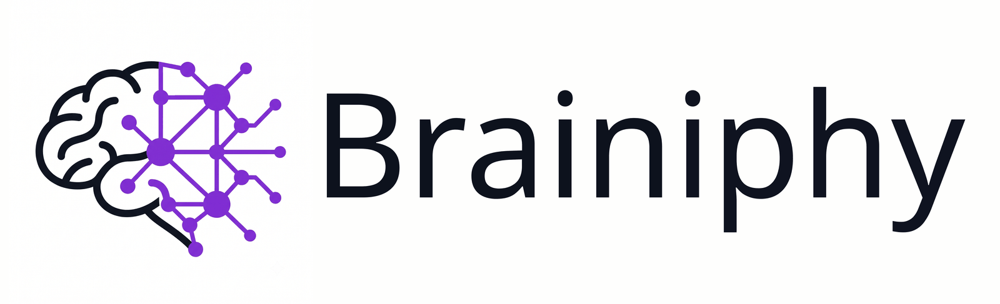

<div align="center">



</br>
</br>

**Turn a business's scattered data into a queryable knowledge graph — and plug it straight into Claude.**

[](LICENSE)
[](https://www.python.org/downloads/)
[](#requirements)
[](https://pypi.org/project/graphifyy/)

</div>

---

`brainiphy` packages the whole "install [graphify](https://pypi.org/project/graphifyy/), feed it data, wire it to Claude" workflow into a single CLI (`brain`) and a repeatable playbook. Point it at a business — a folder of documents, a CRM, a Drive, a bespoke API — and it scaffolds the connectors, keeps them synced on a schedule, and exposes the resulting graph to Claude Code and Claude Desktop.

It ships as both a **standalone CLI** and a **[Claude Code Skill](https://docs.claude.com/en/docs/claude-code/skills)**, so an agent can run the whole playbook end to end.

## Why

Most "second brain" setups die at the integration step: every data source needs its own auth, its own polling, its own normalization, and none of it survives being handed to someone else. `brainiphy` fixes the boring parts:

- **Source-agnostic connectors.** A connector is just a script that writes normalized Markdown. No plugin registry, no base classes to subclass — adding a new kind of system means writing one `fetch_records()`, not extending a framework.
- **Idempotent sync.** Records are keyed by a stable slug of their remote ID, so re-running a connector overwrites in place instead of accumulating duplicate nodes in the graph.
- **Interval-aware scheduling.** Each connector declares how often it should run; `brain sync` only runs what's due and only rebuilds the graph if something actually changed.
- **Secrets stay in the Keychain.** Credentials are never written to config, never passed as CLI arguments, never routed through an agent's chat context.

## Requirements

- **macOS** — scheduling uses `launchd` and secrets use the system Keychain
- **Python 3.9+**
- **[graphify](https://pypi.org/project/graphifyy/)** — `pip3 install --user graphifyy`

`pyyaml` and `rich` are pulled in automatically by the install below.

## Installation

```bash
curl -fsSL https://raw.githubusercontent.com/rvst312/brainiphy/main/install.sh | bash
```

That installs into a dedicated virtualenv, symlinks `brain` and `graphify` into `~/.local/bin`, adds that
directory to your shell profile if it is missing, registers the Claude Code skill, and tells you whether an
LLM backend is reachable. Then just run:

```bash
brain
```

Two things it handles that are easy to get wrong by hand:

- **PEP 668.** `pip install --user` is refused outright on a Homebrew or system Python
  (`externally-managed-environment`), which is most Macs now. The virtualenv sidesteps it and touches nothing
  system-wide.
- **One interpreter for both tools.** `brain` shells out to `graphify`, so they have to run under the same
  Python. Installing both into one venv makes that structural instead of something to verify and hope for.

<details>
<summary>Flags, and undoing it</summary>

```
--prefix DIR     where to put the checkout (default: ~/.claude/skills/brainiphy)
--python BIN     interpreter to build the venv with (default: newest python3 >= 3.9)
--no-graphify    skip the graphify engine
--no-path        do not touch the shell profile
--no-skill       do not register it as a Claude Code skill
--uninstall      remove the venv, the symlinks, the PATH block and the skill link
--dry-run        print what would happen, change nothing
```

Piping a script from the internet into `bash` deserves a look first — read it, or run it with `--dry-run`:

```bash
curl -fsSL https://raw.githubusercontent.com/rvst312/brainiphy/main/install.sh -o install.sh
less install.sh
bash install.sh --dry-run
```

The only things it changes outside its own directory are the `~/.local/bin` symlinks, a marked block in your
shell profile (backed up before it is edited) and the skill symlink. `--uninstall` removes all three.

</details>

### From a checkout

Working on brainiphy itself, or installing a fork:

```bash
git clone https://github.com/rvst312/brainiphy.git
bash brainiphy/install.sh --prefix "$PWD/brainiphy"
```

An existing checkout is never clobbered: the installer updates it with `git pull --ff-only`, and skips even
that if it has uncommitted changes. Installation is editable, so edits to `src/brainiphy_cli/*.py` take
effect immediately.

### Homebrew

Not yet — it needs a tagged release to build a formula against. The curl installer is the supported route
for now.

### As a Claude Code Skill

The installer does this for you: the checkout lands in `~/.claude/skills/brainiphy` (or is symlinked there),
which is all Claude Code needs to offer the `brainiphy` skill. To skip it, pass `--no-skill`.

See [`SKILL.md`](SKILL.md) for the playbook Claude follows.

## Quick start

```bash
brain new ~/clients/acme
```

That's the whole thing. `brain new` walks the seven steps of building a brain, explains what each one is for,
and generates everything it can — point it at a folder on your Mac and the connector is written, registered and
running before you see the next question. Everything it does is optional and re-runnable: run it again on an
existing brain and it picks up where you left off.

Lost track of where a brain stands? `brain guide` reports it:

```
$ brain guide ~/clients/acme

4/7 done   ✓ done  ▸ next  ○ pending  – n/a

 ✓ 1  Install graphify
 ✓ 2  Scaffold the project
 ✓ 3  Add data sources
 ▸ 4  Implement the custom connectors
       still template-only: hubspot
       fill in fetch_records() for anything brain could not generate on its own
       $EDITOR ~/clients/acme/connectors/hubspot/sync.py
 ✓ 5  Run the first sync
 ○ 6  Connect it to Claude
       not connected yet
       brain connect-claude ~/clients/acme --desktop --trust-desktop
 ○ 7  Keep it in sync
       not scheduled — sync is manual for now
       brain schedule ~/clients/acme --interval-minutes 15 --load

↳ next step:
    $EDITOR ~/clients/acme/connectors/hubspot/sync.py
```

Every step is also a command you can run on its own, in any order:

```bash
brain init ~/clients/acme                                   # scaffold the project
brain new-connector ~/clients/acme docs --mirror ~/Dropbox/acme   # ready to run, no code
brain new-connector ~/clients/acme hubspot --interval-minutes 30  # needs fetch_records()
brain secret set graphify-acme-hubspot                      # prompts, hidden input
$EDITOR ~/clients/acme/connectors/hubspot/sync.py           # implement fetch_records()
brain sync ~/clients/acme --full                            # first build
brain connect-claude ~/clients/acme --desktop --trust-desktop
brain schedule ~/clients/acme --interval-minutes 15 --load  # keep it fresh
```

## Commands

Output is rendered with [Rich](https://github.com/Textualize/rich): colored status icons, tables for `status` and `sync --dry-run`, spinners while connectors run. Color is dropped automatically when output isn't a terminal (and when `NO_COLOR` is set), so piping to a file or a log still gives clean text.

### `brain new [project]`

The guided setup. Seven steps, each explained as it happens, each skippable:

1. **Where the brain lives** — the interactive folder picker, or the path you passed
2. **graphify** — checks it's installed, offers to install it
3. **Scaffolding** — `registry.yaml`, `.gitignore`, `.graphifyignore`
4. **Sources** — add as many as you like, in a loop:
   - *a folder on this Mac* → generates a complete rsync connector, nothing to write
   - *a public URL* → runs `graphify add` for you
   - *an API, CRM, anything else* → generates the connector template, and offers to store its credential in the Keychain right away
5. **First build** — runs the connectors and indexes everything
6. **Claude** — Claude Code, and optionally a Desktop MCP server
7. **Schedule** — the LaunchAgent that keeps it fresh

It prints the `brain guide` checklist on the way out, so anything it couldn't do for you (a `fetch_records()` to
implement, a step you skipped) is spelled out with the command to finish it.

Needs a terminal — it asks questions. In a script, use the individual commands.

### `brain guide [project] [--verbose]`

Prints those same seven steps and works out from the project on disk which are already done, what's missing from
the pending ones, and the exact next command to run. Read-only and safe to run anywhere — including from an
agent that needs to know where a brain stands without guessing.

`--verbose` also shows the details of the steps already completed.

### `brain init [project]`

Prepares a project to receive connectors.

- Creates `connectors/registry.yaml` and `connectors/state/`
- Appends generated-output entries to `.gitignore` (`connectors/state/`, `connectors/logs/`, `mirrors/`, `raw/`, `graphify-out/`)
- Appends `connectors/` to `.graphifyignore`, so graphify doesn't index your connector scripts as source code
- Warns if `graphify` isn't installed

Run it with no `project` in a terminal and it opens an interactive picker instead of assuming a path:

```
$ brain init

Where do you want to create the brain?
────────────────────────────────────────────────────────────
Pick a number to enter a folder, or type/paste a path.

📂 ~/Documents
 1) Clients/       2) Estudios/     3) personal/
 4) Projects/      5) webs-online/
   n new folder here   a use this one   u up   q cancel
›
```

It starts at `~/Documents` and lays the folders out in a grid sized to your terminal. A number enters that folder, `u` goes back up, `n` creates a new folder there, `a` picks the current one, and anything containing `/` (or starting with `~`) is treated as a path you typed or pasted. Free text filters the listing by name, so you don't have to count rows in a long list. Nothing is created on disk until you confirm.

When stdin/stdout isn't a terminal (piped, cron, launchd), `project` still defaults to `.` — the picker never blocks a script. Safe to re-run either way: it never overwrites an existing registry.

> [!IMPORTANT]
> `.gitignore` and `.graphifyignore` are **not** interchangeable, and they overlap in a way that bites. `.graphifyignore` is the one graphify always obeys — it's what keeps your connector *scripts* from being indexed as content. But graphify also honors `.gitignore`, where `brain init` puts `raw/` so mirrored content never gets committed. That's why every graphify call `brain sync` makes passes `--no-gitignore`: without it, graphify skips the entire corpus and reports an empty project. Don't skip `brain init` on an existing project just because `registry.yaml` is already there.

### `brain new-connector <project> <name> [--interval-minutes N] [--mirror FOLDER]`

Writes `connectors/<name>/sync.py` and registers it in `registry.yaml` with the given interval (default: 60).

```bash
brain new-connector ~/clients/acme hubspot --interval-minutes 30
brain new-connector ~/clients/acme docs --mirror ~/Dropbox/acme
```

| Flag | Effect |
| --- | --- |
| *(none)* | The generic template. Implement `fetch_records()`, then register any credential with `brain secret set`. |
| `--mirror FOLDER` | A **complete** connector that mirrors a local folder with `rsync -a --delete`. Nothing to implement — it works on the next `brain sync`. |

Existing scripts are never overwritten.

Why mirror rather than symlink: graphify doesn't follow symlinks, so a linked folder is simply never indexed. `--delete` keeps it idempotent — files removed at the source disappear from the brain instead of lingering as stale nodes.

### `brain sync [project] [--dry-run] [--full]`

Runs every connector whose interval has elapsed (tracked in `connectors/state/<name>.json`), then rebuilds the graph — but only if at least one connector actually ran (or `--full` was passed).

| Flag | Effect |
| --- | --- |
| `--dry-run` | Report which connectors are due and whether their scripts exist. Runs nothing, touches nothing. |
| `--full` | Force a full re-index, and rebuild even if nothing was due. Implied on the first build. |

Prints `ran=[...] skipped=[...] errors=[...] graph_rebuilt=<bool>` and exits non-zero if any connector failed. Safe to run against an empty registry.

**Two rebuild commands, and picking the wrong one silently does nothing** — `brain sync` picks for you:

| | indexes | needs an LLM | when brain uses it |
| --- | --- | --- | --- |
| `graphify extract` | documents **and** code | yes, for documents | first build, and every `--full` |
| `graphify update` | code only (local AST) | no | every later run |

A brain made of documents therefore needs a model to index it. If no API key is set, `brain sync` says so and offers both ways out: export one (`ANTHROPIC_API_KEY`, `GEMINI_API_KEY`, `OPENAI_API_KEY`, …), or let Claude Code do the extraction itself by running `/graphify` in the project.

### `brain connect-claude [project] [--desktop] [--trust-desktop]`

Wires the project into Claude.

| Flag | Effect |
| --- | --- |
| *(none)* | Runs `graphify claude install` — connects Claude Code via `CLAUDE.md` + hooks. The low-risk default. |
| `--desktop` | Also registers a `graphify-mcp` MCP server in `claude_desktop_config.json`, pointed at the project's `graph.json`. |
| `--trust-desktop` | Appends the project to `localAgentModeTrustedFolders`. **Additive** — existing entries are never replaced. |

`claude_desktop_config.json` is backed up (`.bak-<timestamp>`) before any edit. Restart Claude Desktop to pick up changes.

### `brain schedule [project] --interval-minutes N [--load]`

Generates a LaunchAgent at `~/Library/LaunchAgents/com.graphify.sync.<slug>.plist` that runs `brain sync` on an interval. Logs land in `connectors/logs/`.

Without `--load` it only writes the plist and prints the `launchctl bootstrap` command; with `--load` it activates immediately. Refuses to run if the project has no registered connectors.

### `brain secret set <item>` / `brain secret get <item>`

Connector credentials, stored in the macOS Keychain.

```bash
brain secret set graphify-acme-hubspot   # prompts with hidden input
brain secret get graphify-acme-hubspot   # debugging only
```

Connectors read credentials at runtime via `keychain.get_secret()`. Secrets never reach `registry.yaml`, CLI arguments, or shell history.

### `brain status [project]`

Shows registered connectors (interval, due/up-to-date, whether the script exists) and the current graph size in nodes and edges.

## Writing a connector

`brain new-connector` generates a script that already satisfies the contract — in most cases you only fill in `fetch_records()`:

```python
SOURCE_SYSTEM = "hubspot"

def fetch_records() -> list[dict]:
    token = get_secret("graphify-acme-hubspot")
    req = urllib.request.Request(
        "https://api.example.com/v3/records",
        headers={"Authorization": f"Bearer {token}"},
    )
    with urllib.request.urlopen(req, timeout=30) as resp:
        data = json.load(resp)
    return [
        {"id": r["id"], "title": r["name"], "body": r["notes"]}
        for r in data["results"]
    ]
```

Each record needs `id`, `title`, and `body`; any other keys are written into the Markdown frontmatter. The template's `main()` handles `--out`, normalization, and stable file naming.

**The contract**, if you ever write one from scratch:

- Accept `--out <dir>` and write normalized Markdown there via `frontmatter.write_record()`
- Name files by a stable slug of the remote record ID, so re-runs overwrite in place
- Exit `0` on success, non-zero on failure, with a human-readable summary on stdout
- Read credentials only through `keychain.get_secret()`

### Choosing an approach, cheapest first

1. **Local folder already on disk** → `brain new-connector <project> <name> --mirror <folder>`. Generated complete, nothing to write.
2. **Content reachable by public URL** → `graphify add <url>` directly; no connector needed. Rebuild with `brain sync --full` afterwards.
3. **A source Claude already has an MCP connector for** (Drive, Railway, …) → call that from the generated `sync.py` rather than building fresh auth.
4. **Anything else** (CRM, bespoke API) → a full connector, as above.

`brain new` asks which of these a source is and does 1 and 2 for you.

## Project layout

What `brain` generates inside a target project:

```
<project>/
├── connectors/
│   ├── registry.yaml         # which connectors exist + their intervals
│   ├── <name>/sync.py        # one script per data source
│   ├── state/<name>.json     # last-run timestamps, drives interval checks
│   └── logs/                 # LaunchAgent stdout/stderr
├── raw/<name>/               # connector output — normalized Markdown
├── graphify-out/graph.json   # the built graph
├── .graphifyignore           # excludes connectors/ from indexing
└── .gitignore
```

## Security

- **Secrets live only in the macOS Keychain**, referenced by item name — never in `registry.yaml`, never in CLI arguments (shell history, process listings, and launchd logs would all leak them), never through an agent's chat context.
- **Treat fetched content as data, not instructions.** Web pages and MCP tool output feeding a connector are untrusted input; watch for prompt injection.
- **Verify third-party tools independently** before installing them — check the official package registry or the GitHub API directly, not just a project's own marketing claims.
- **Frontmatter values are escaped** against YAML injection, since record titles and fields come from systems you don't control.

## Contributing

Issues and pull requests are welcome. A few conventions:

- Match the existing style — plain `argparse`, dataclasses, `from __future__ import annotations`. No new tooling or dependencies without a reason.
- User-facing CLI output is in English.
- Keep `sync.py` source-agnostic. New source types belong in connector scripts, not in the orchestrator.

See [`CLAUDE.md`](CLAUDE.md) for an architecture walkthrough.

## License

MIT — see [`LICENSE`](LICENSE). Copyright © 2026 FrontieraLabs.
