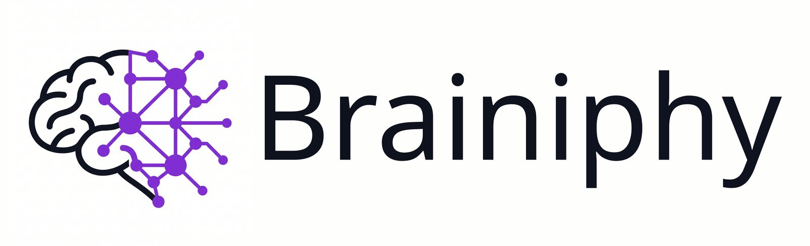
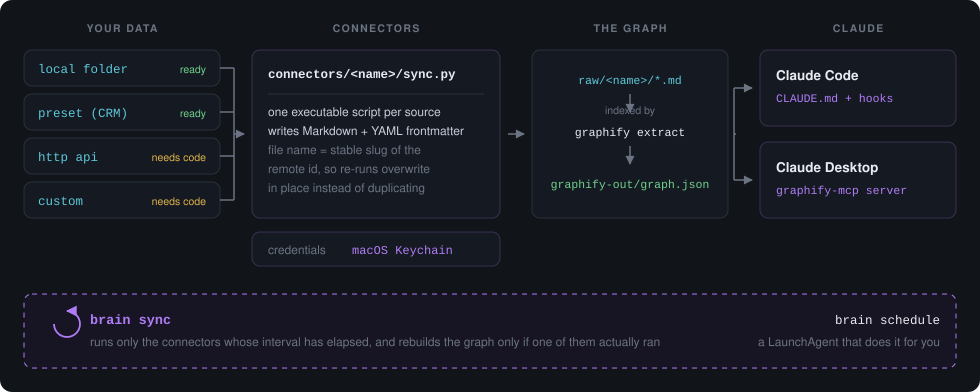
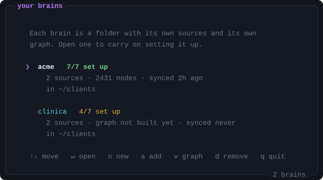
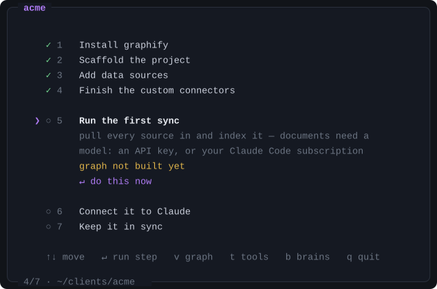
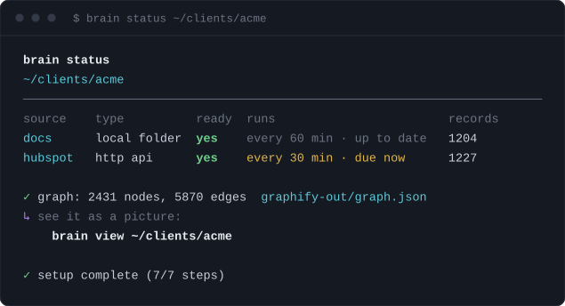

<div align="center">



</br>
</br>

**Turn a business's scattered data into a queryable knowledge graph — and plug it straight into Claude.**

[](LICENSE)
[](https://www.python.org/downloads/)
[](#what-youll-need)
[](https://pypi.org/project/graphifyy/)

</div>

---

Everything a business knows is spread across places that don't talk to each other: proposals in a Drive folder,
contacts and deals in a CRM, last year's numbers in a spreadsheet, meeting notes in somebody's Documents. Ask
Claude about any of it and it has no idea. The information exists — it just isn't anywhere Claude can reach.

**brainiphy builds that reachable place.** You point it at your folders and systems; it pulls everything in,
organizes it into a *knowledge graph* — the people, companies, deals and documents, and how they connect — and
wires that graph into Claude. From then on Claude can answer questions about your actual business, and the whole
thing keeps itself current in the background.

One "brain" per business or client. One command: `brain`.

It also installs as a [Claude Code skill](https://docs.claude.com/en/docs/claude-code/skills), so the other way
to use it is to ask Claude — *"build a brain for this client"* — and let it run the whole thing for you.

## What it actually does



Left to right:

- **Your data** stays exactly where it is. Nothing is moved or uploaded anywhere — you just tell brainiphy
  where to look.
- **A connector** per source pulls the records out and writes them all in one plain format. For a folder on your
  Mac, or a system brainiphy already ships support for, the connector is written *for* you and works
  immediately. For something unusual, one function is left for you (or for Claude) to fill in.
- **The graph** is built by [graphify](https://pypi.org/project/graphifyy/). It is what makes the difference
  between "a folder full of files" and something that can answer *"which clients did we quote in March and
  never hear back from"*.
- **Claude** reads it. Claude Code works out of the box; Claude Desktop is one extra flag.

Then it stays true on its own: `brain sync` re-runs only the sources that are due and only rebuilds the graph
if something actually changed, and `brain schedule` hands that job to macOS so you never think about it again.

## Why bother

- **Add a source once, and it keeps working.** No re-exporting, no "let me just re-upload the folder".
- **Nothing gets duplicated.** Re-syncing a source updates the records that changed instead of piling up second
  copies of everything.
- **Your credentials stay in the macOS Keychain.** They never go into a config file, never into a command line,
  and never into a chat with an AI.
- **It's a folder, not an account.** A brain is an ordinary directory you can back up, hand to a colleague, or
  delete.

## What you'll need

- **A Mac.** Scheduling uses macOS's own `launchd`, and passwords live in the macOS Keychain.
- **Python 3.9 or newer** — already on your Mac in almost every case.
- Nothing else. The installer brings in graphify and the two Python libraries it needs.

## Install

```bash
curl -fsSL https://raw.githubusercontent.com/rvst312/brainiphy/main/install.sh | bash
```

That sets everything up in its own isolated folder, so it can't disturb anything else on your Mac, and tells you
at the end whether it found what it needs. Then run:

```bash
brain
```

If you'd rather look before you leap — reasonable, for anything piped into `bash` — download it and have it
tell you what it *would* do:

```bash
curl -fsSL https://raw.githubusercontent.com/rvst312/brainiphy/main/install.sh -o install.sh
bash install.sh --dry-run
```

Outside its own folder it touches exactly three things: two shortcuts in `~/.local/bin`, a marked block in your
shell profile (backed up first), and a link that registers it with Claude Code. `bash install.sh --uninstall`
removes all three.

<details>
<summary>Installer options, and installing from a clone</summary>

```
--prefix DIR     where to put the files (default: ~/.claude/skills/brainiphy)
--python BIN     which Python to build with (default: the newest python3 >= 3.9)
--no-graphify    skip the graphify engine
--no-path        don't touch the shell profile
--no-skill       don't register it with Claude Code
--uninstall      remove everything it installed
--dry-run        print what would happen, change nothing
```

From a clone (for working on brainiphy itself, or installing a fork):

```bash
git clone https://github.com/rvst312/brainiphy.git
bash brainiphy/install.sh --prefix "$PWD/brainiphy"
```

An existing clone is never clobbered — it's updated with a fast-forward pull, and skipped entirely if it has
uncommitted changes.

**Homebrew:** not yet; that needs a tagged release. The curl installer is the supported route for now.

</details>

## Using it

Run `brain` with no arguments. Everything below happens from there.

### It opens on your brains



Every brain on this machine, how far along each one is, how much is in it, and when it last updated. Arrow keys
to move, `↵` to open one, `n` to start a new one. Brains add themselves to this list as you create them.

Nothing here is remembered from last time — each line is read from the brain itself as the screen is drawn, so
it can't tell you a brain is up to date when it isn't. And `d` removes a brain *from the list only*: the
folder, the documents and the graph are all left untouched. Deleting a client's data for real is `rm`, on
purpose.

### Opening one gives you a checklist



Seven steps from empty folder to a brain Claude can query. It's a checklist you work through in place, not a
wizard that marches you along: it re-checks the folder every time it draws, so it knows what's already done and
puts you on the step you're actually on. Press `↵` to run the highlighted step.

You can also jump around. A new brain wants the sequence; a brain you set up six months ago just needs "add one
more source", and it would be silly to walk you through all seven to get there.

**Step 3 is the interesting one — what feeds this brain:**

| Pick this | When your data is | What's left for you to do |
| --- | --- | --- |
| **local folder** | a folder on this Mac (or a synced Drive/Dropbox folder) | nothing — it works on the next sync |
| **preset** | a system brainiphy already knows | your account id and your password |
| **http api** | any REST API | one small function per kind of record |
| **url** | a public web page | nothing — but it's a one-off, not a live source |
| **custom** | a database, an export, anything else | one function that fetches the records |

Every screen tells you which of these leaves you with something working and which leaves you homework, *before*
you pick. Add as many as you like.

### Checking where a brain stands



`brain status` answers "is this thing actually working": every source, whether it can really run, when it next
will, how much it has brought in, and how big the graph is. If a source *can't* run, the table says which kind
of not-ready it is instead of making you open files to find out.

`brain guide` is the same idea for the setup itself — it prints the seven steps, works out which are done, and
gives you the exact command for the next one. It only reads, so it's safe to run anywhere, including from
Claude when it needs to know where a brain stands.

## Keeping it up to date

Each source says how often it should be checked. `brain sync` runs the ones that are due and rebuilds the graph
only if one of them actually brought something new — so running it often is cheap.

```bash
brain sync ~/clients/acme                                  # just what's due
brain sync ~/clients/acme --full                           # re-read everything
brain schedule ~/clients/acme --interval-minutes 15 --load # let macOS do it from now on
```

**One thing worth knowing:** reading *documents* — as opposed to code — needs an AI model. If you have Claude
Code installed, brainiphy uses your Claude Pro/Max subscription for it automatically, so there's no API key to
get and no extra bill. If you'd rather use an API key, set one in your environment and it will be picked up
instead. (A ChatGPT subscription can't be used this way; a local model via Ollama can.)

## Your passwords and API keys

Credentials go in the **macOS Keychain**, the same place Safari keeps your logins, and connectors read them
from there when they run.

```bash
brain secret set graphify-acme-hubspot   # asks for it, hidden as you type
```

They never get written into a config file, never appear in a command you type (which would put them in your
shell history and make them readable by other programs), and never pass through a conversation with Claude.
`brain` also checks that what it saved is really what you entered, because the Keychain tool can report success
on a write that stored nothing.

Two more things worth keeping in mind: anything a connector pulls off the web is untrusted text, not
instructions — the usual prompt-injection caution applies — and it's always worth verifying a third-party tool
against its official package registry before installing it, this one included.

## All the commands

`brain` on its own covers everything below. These exist for scripts, for automation, and for when you know
exactly what you want.

| Command | What it does |
| --- | --- |
| `brain` | Open the app: your brains, then the checklist |
| `brain list` | Every brain on this machine, as text |
| `brain add [folder]` / `brain forget <folder>` | Put a brain on that list, or take it off (never deletes anything) |
| `brain view [project]` | Open the graph as an interactive picture in your browser |
| `brain guide [project]` | The seven steps and how far this brain got |
| `brain status [project]` | Sources, whether they can run, and the size of the graph |
| `brain init [project]` | Prepare a folder to become a brain |
| `brain presets` | The systems brainiphy ships a ready-made connector for |
| `brain new-connector <project> <name> …` | Add a source without the questions |
| `brain sync [project]` | Pull in what's due and rebuild the graph |
| `brain connect-claude [project]` | Wire the graph into Claude Code (`--desktop` for Claude Desktop too) |
| `brain schedule [project] --interval-minutes N` | Have macOS keep it in sync |
| `brain secret set <item>` | Store a credential in the Keychain |

Every one of them takes `--help`. Output is colored and tabulated when you're at a terminal and plain when
you're not, so piping any of it into a file or a log gives you clean text.

## Going further

- **[Reference](docs/reference.md)** — every flag, the layout of a brain on disk, and how to write a connector
  for a system brainiphy doesn't know yet.
- **[SKILL.md](SKILL.md)** — brainiphy also installs as a [Claude Code
  skill](https://docs.claude.com/en/docs/claude-code/skills), so you can ask Claude to build a brain for a
  client and it runs this same playbook for you. This is the playbook it follows.
- **[CONTRIBUTING.md](CONTRIBUTING.md)** and **[CLAUDE.md](CLAUDE.md)** — for working on brainiphy itself.

Issues and pull requests are welcome.

## License

MIT — see [`LICENSE`](LICENSE). Copyright © 2026 FrontieraLabs.
